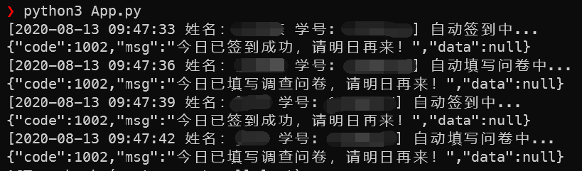

# AutoCheckIn
> 防疫签到的一些处理方法(Python version)  
> 因为无教师账号，教师签到暂且不做，目前学生签到无问题  

## Preview


## Run
> 在 `App.py` or `AutoCheckIn.exe` 同级目录下面创建一个 `config.json` 文件  
> 可以添加多个用户消息，方便批量打卡ヾ(≧▽≦*)o  

```json5
[
    {
        "loginName": "student id",
        "yzxx": "student name",
        "loginType": 0,
        "checkIn":{}, //签到的数据
        "paper":{} // 问卷的数据
        // 推荐通过下面方式获取数据，增加可信度
    },
    {
        "loginName": "student id",
        "yzxx": "student name",
        "loginType": 0,
        "checkIn":{}, //签到的数据
        "paper":{} // 问卷的数据
        // 推荐通过下面方式获取数据，增加可信度
    }
]
```

1. 登录网站： [https://fxgl.jx.edu.cn/4136010406/](https://fxgl.jx.edu.cn/4136010406/)
2. `F12` 打开 `console`
3. 进入每日签到界面
4. `console` 输入 `submits` 定位代码打上断点，进行一次提交，卡住时终端输入 `console.log(JSON.stringify(param))`
5. 将输出的数据用来覆盖 `config.json` 里面的 `checkIn` 的值
6. 进入问卷调查界面
7. `console` 输入 `submit`
8. 双击查看代码
9. 在 `2683` 行打上断点，然后手动提交，卡住时终端输入 `console.log(JSON.stringify(param))`
10. 将输出的数据用来覆盖 `config.json` 里面的 `paper` 的值
11. 前往 [https://npm.taobao.org/mirrors/chromedriver/](https://npm.taobao.org/mirrors/chromedriver/) 下载对应版本的 `chromedriver`
12. 将 `chromedriver` 添加到环境变量 (Linux 可直接通过软件源安装: sudo apt install chromedriver chromium -y)
13. Run: `*.exe`
15. 提交测试通过以后，可以选择 **添加定时任务**，并且执行后可以选择保留窗口，方便查错。

### Example
* 使用 `Ubuntu18.04` 定时任务进行打卡

1. `sudo apt-get update -y && sudo apt install python3 git -y`
2. `git clone https://github.com/IITII/AutoCheckIn.git && cd AutoCheckIn`
3. `pip install -r requirements.txt` or `pip install -r requirements.txt -i  -i https://pypi.tuna.tsinghua.edu.cn/simple`
4. `python3 App.py` or `python3 App.py >> log.log`
> 每日 9.30 自动打卡，日志写入 `./log.log`  
5. 添加定时任务: <code>echo "30 9 * * * cd \$(pwd) && python3 ./App.py >> ./log.log 2>&1" /var/spool/cron/crontabs/\$(whoami)</code>
6. 查看定时任务: `crontab -l`

## 一些注意事项
1. 目前只支持 `Chrome` ,暂时没有支持其他浏览器的计划